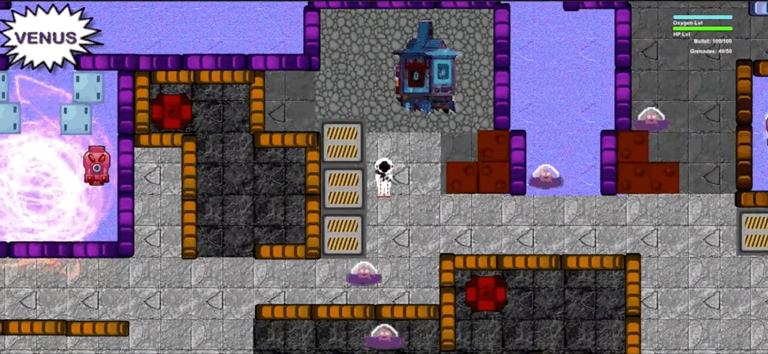

# Space Hero
Game (2d) developed in Unity in the context of a module at university. Worked in a team with eight membes following the Scrum framework, having the role of a developer. 

The game is located in space with the player being an astronaut. It consists of five scenes:
<ul>
<li><strong> Galaxy: </strong> The game starts from here. It contains the background story of the game and the player needs to move to Mars to begin fighting the enemies. </li>
<li> <strong> Mars: </strong> The first scene where the player fights the enemies.</li>
<li> <strong> Venus: </strong> More intricate scene with a larger number of enemies and less recources compared to mars.</li>
<li> <strong> Space Station: </strong> A scene with no enemies but a lot of recourses such as bullets and grenades.</li>
<li> <strong> Final scene: </strong> The final scene of the game with the boss enemy. If the boss is defeated the game ends. </li>
</ul>

### Instructions

<ul>
<li> <strong> Walking: </strong> WASD keys or arrow keys. </li>
<li> <strong> Sprinting: </strong> move + Shift
<li> <strong> Gun shooting: </strong> left mouse click. </li>
<li> <strong> Throwing grenades: </strong> right mouse click. </li>

<li> The player can collect health kits either from the space station or as a drop item when an enemy dies.</li>
 
<li> The player needs to collect oxygen from the oxygen stations (buildings with flickering lights if there is still available oxygen there).</li>

<li>The player can move back and forth to different scenes through the designated portals.</li>
</ul>

